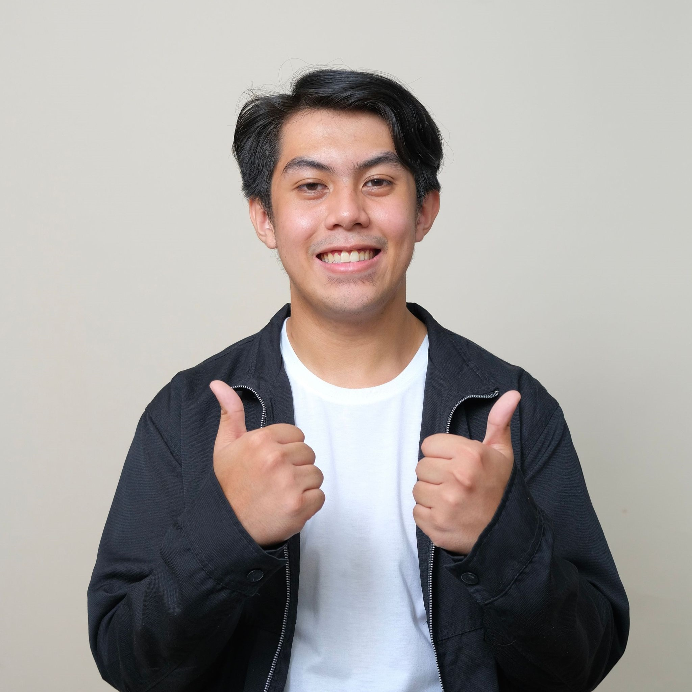
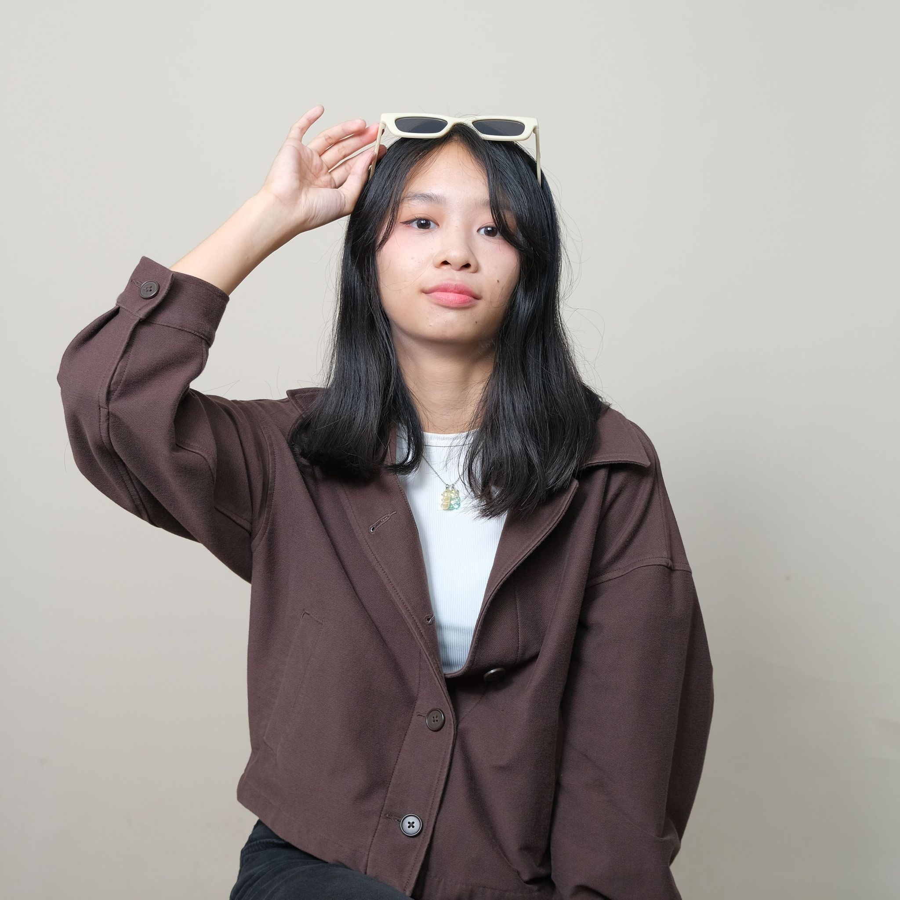

  

  

 <b>Cat-alogue</b>   <i>your purrfect companion</i>

## Description

Cat-alogue is a web application that serves as a platform for aspiring pet-owners. Cat-alogue mainly displays cats that are for adoption with all the details that are needed that connects owners and aspiring pet-owners for a smooth adoption transaction. We believe that each cat deserves a beautiful and comfortable home where they can live one of their nine feline lives peacefully with their new loving owners.

## Features 

- **Display For-Adoption Cats:**
    Cat-alogue allows cat-owners to put up their cats for adoptions with all of their details. 

- **Browse Cats:**
    Cat-alogue guests can browse through the catalogue of cats that are put up by the owners. The individual cat pages have their own description of the feline containing its _breed_, _date of birth_, _contact number_, and more. 

- **Adoption Process:**
    Cat-alogue serves to make the adoption process as smooth as possible with Cat-alogue guests and pet owners. Guests can mark individual cats that they're interested to adopt. Cat owners can also view the list of interested guests with all their accompanying personal information to bridge the gap of communication.

- **Admin Dashboard:**
  Cat-alogue also has an admin dashboard that allows admins of the website to oversee all of the data that's running the website. This includes manually adding customers, verifying customer and cat-owner accounts, and many more.

## Entity Relationship Diagram

## Tech Stack
**<h3> [Frontend](front-end)</h3>**

**<h3> [Backend](back-end)</h3>**

## Cat-alogue (Screenshots)

## Contributors

|  |  |  |
| ------------------------------------------------------------------------------------------------ | ---------------------------------------------------------------------------------------------- | ----------------------------------------------------------------------------------------------- |
| <h4>[Macias, Aaron Justin](https://github.com/catsnax)</h4>                                     | <h4>[Kuan, Anya Patricia](https://github.com/kunpaoo)</h4>                                    | <h4>[Linaza, Avril Lalaine](https://github.com/avrlalnex)</h4>                                   |

